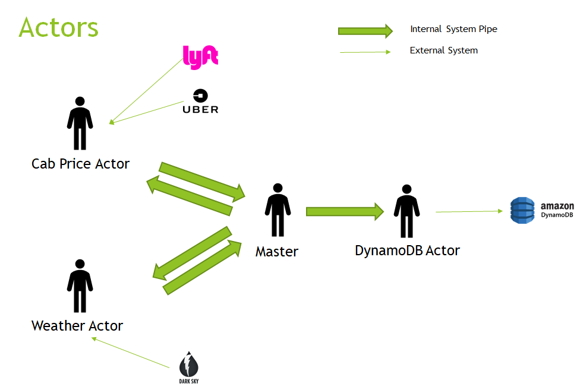
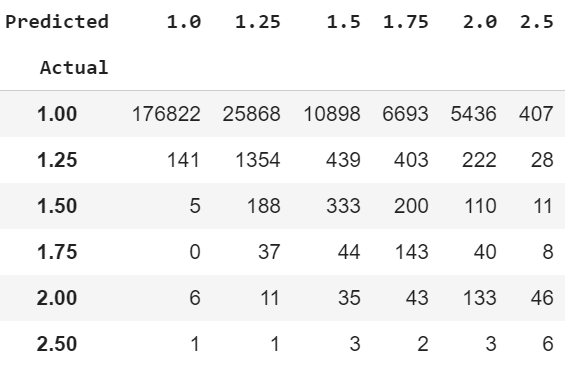

# scala-spark-cab-rides-predictions
A big data project for predicting prices of Uber/Lyft rides depending on the weather

## Contributors:
* Ravi Munde
* Karan Barai

### Project Structure :
* cab-price-connector - Data Collection Scala Project
* Databricks_Prediction_code.html - Anlysis and Spark Model(From Databricks.com)
* Cab_Price_Prediction.ipynb - Random Forrest Model in Python

### Data Model:

#### CabPrice
root 
 &nbsp;&nbsp;&nbsp;&nbsp;|- cab_type : String 
  &nbsp;&nbsp;&nbsp;&nbsp;|- destination : String 
  &nbsp;&nbsp;&nbsp;&nbsp;|- distance: Float 
  &nbsp;&nbsp;&nbsp;&nbsp;|- id: String 
  &nbsp;&nbsp;&nbsp;&nbsp;|- name: String 
  &nbsp;&nbsp;&nbsp;&nbsp;|- price: Float 
  &nbsp;&nbsp;&nbsp;&nbsp;|- product_id: String 
  &nbsp;&nbsp;&nbsp;&nbsp;|- source: String 
  &nbsp;&nbsp;&nbsp;&nbsp;|- surge_multiplier: String 
  &nbsp;&nbsp;&nbsp;&nbsp;|- time_stamp:Long 

#### Weather
root 
&nbsp;&nbsp;&nbsp;&nbsp;|- clouds : Float 
&nbsp;&nbsp;&nbsp;&nbsp;|- humidity : Float 
&nbsp;&nbsp;&nbsp;&nbsp;|- location : Float 
&nbsp;&nbsp;&nbsp;&nbsp;|- location : String 
&nbsp;&nbsp;&nbsp;&nbsp;|- temp : String 
&nbsp;&nbsp;&nbsp;&nbsp;|- pressure : Float 
&nbsp;&nbsp;&nbsp;&nbsp;|- wind : Float 

Sample log of Actor System Running on EC2 

`INFO [CabRideSystem-akka.actor.default-dispatcher-2] a.DynamoActor - received 12 number of weather records` 
`INFO [CabRideSystem-akka.actor.default-dispatcher-4] a.DynamoActor - Weather Batch processed on DynamoDB` 
`INFO [CabRideSystem-akka.actor.default-dispatcher-9] a.DynamoActor - received 156 number of cab price records` 
`INFO [CabRideSystem-akka.actor.default-dispatcher-8] a.DynamoActor - Cab Prices Batch processed on DynamoDB` 
`INFO [CabRideSystem-akka.actor.default-dispatcher-7] a.Master - Cab ride data piped to Dynamo Actor` 
`INFO [CabRideSystem-akka.actor.default-dispatcher-13] a.DynamoActor - received 156 number of cab price records` 
`INFO [CabRideSystem-akka.actor.default-dispatcher-15] a.DynamoActor - Cab Prices Batch processed on DynamoDB` 

*NOTE: AWS Creditials need to be put in environment vairables*

### Model Evaluation Matrices
* Regression R_squared = 0.62
* Random Forrest Regression's Price Prediction Accuracy : 92.79 %
* Random Forrest Classification Surge Prediction Accuracy: 77.69 % 
  
Confusion Matrix for the Classifier 

